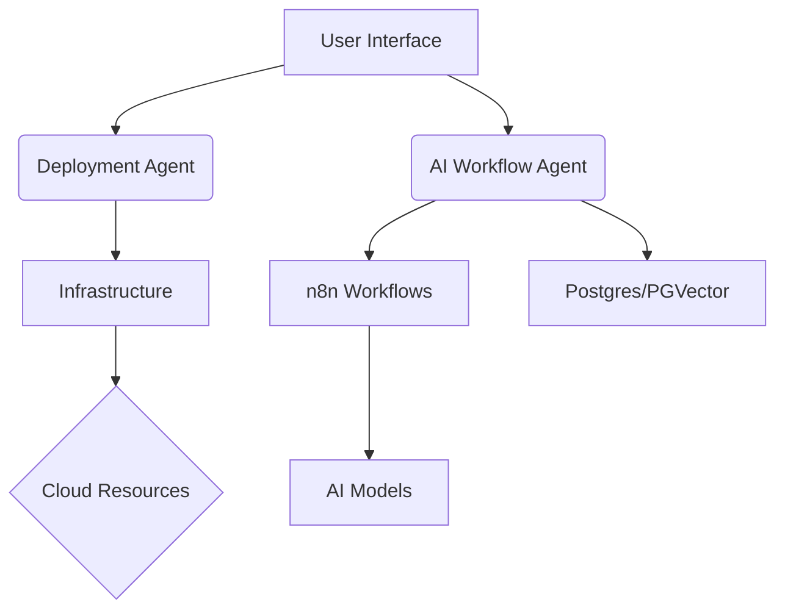

# AI Agent System Documentation

## Overview
This project implements a distributed AI agent system with the following core components:

### Agent Types
1. **Deployment Agent**
   - Manages infrastructure provisioning and service deployment
   - Integrates with Terraform, Docker, and cloud providers
   - Monitoring: systemd/local-ai-packaged.service

2. **Monitoring Agent**
   - Collects metrics through Prometheus/Grafana
   - Manages logs via Graylog
   - Alert triggers in monitoring/rules/alerts.yml

3. **AI Workflow Agent**
   - Coordinates n8n workflows (Local_RAG_AI_Agent.json)
   - Manages Flowise integration
   - Handles document processing and Slack integration

4. **Security Agent**
   - Enforces security protocols from SECURITY_BASELINE.md
   - Manages SSL/TLS configuration
   - Oversees authentication workflows

## Architecture Diagram

## Agent Communication
- Uses Redis for pub/sub messaging
- REST API endpoints defined in portal/portal.py
- Real-time updates via scripts/tests/05_realtime_ws_test.py
