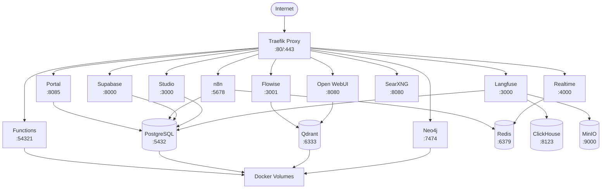
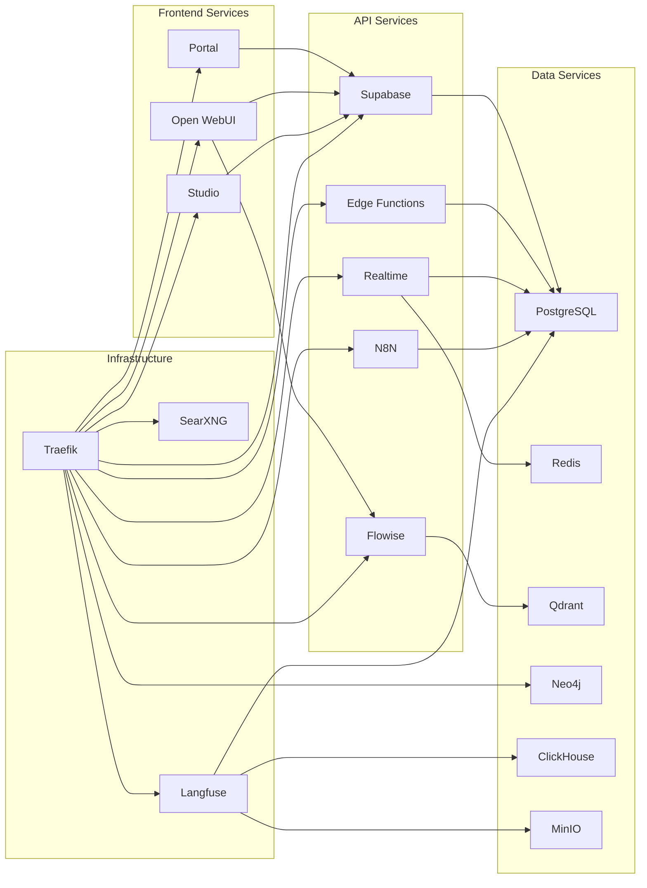
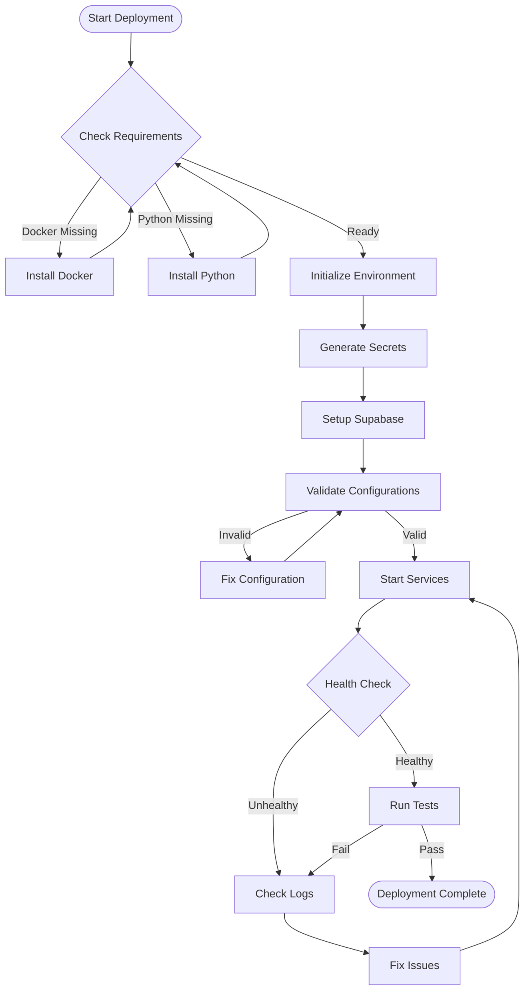

# Mermaid Architecture Diagrams

## Overall System Architecture

```mermaid
graph TB
    Internet([Internet]) --> Traefik[Traefik Proxy<br/>:80/:443]
    
    Traefik --> Portal[Portal<br/>:8085]
    Traefik --> N8N[n8n<br/>:5678]
    Traefik --> Flowise[Flowise<br/>:3001]
    Traefik --> WebUI[Open WebUI<br/>:8080]
    Traefik --> Supabase[Supabase<br/>:8000]
    Traefik --> Studio[Studio<br/>:3000]
    Traefik --> Functions[Functions<br/>:54321]
    Traefik --> Realtime[Realtime<br/>:4000]
    Traefik --> SearXNG[SearXNG<br/>:8080]
    Traefik --> Langfuse[Langfuse<br/>:3000]
    Traefik --> Neo4j[Neo4j<br/>:7474]
    
    Portal --> PostgreSQL[(PostgreSQL<br/>:5432)]
    N8N --> PostgreSQL
    Supabase --> PostgreSQL
    Studio --> PostgreSQL
    Langfuse --> PostgreSQL
    
    Flowise --> Qdrant[(Qdrant<br/>:6333)]
    WebUI --> Qdrant
    
    N8N --> Redis[(Redis<br/>:6379)]
    Realtime --> Redis
    
    Langfuse --> ClickHouse[(ClickHouse<br/>:8123)]
    Langfuse --> MinIO[(MinIO<br/>:9000)]
    
    Functions --> Storage[Docker Volumes]
    PostgreSQL --> Storage
    Qdrant --> Storage
    Neo4j --> Storage
```

## Service Dependencies

```mermaid
graph LR
    subgraph "Frontend Services"
        Portal
        WebUI[Open WebUI]
        Studio
    end
    
    subgraph "API Services"
        Supabase
        Functions[Edge Functions]
        Realtime
        N8N
        Flowise
    end
    
    subgraph "Data Services"
        PostgreSQL
        Redis
        Qdrant
        Neo4j
        ClickHouse
        MinIO
    end
    
    subgraph "Infrastructure"
        Traefik
        SearXNG
        Langfuse
    end
    
    Portal --> Supabase
    WebUI --> Supabase
    WebUI --> Flowise
    Studio --> Supabase
    
    Supabase --> PostgreSQL
    Functions --> PostgreSQL
    Realtime --> PostgreSQL
    Realtime --> Redis
    N8N --> PostgreSQL
    Flowise --> Qdrant
    
    Langfuse --> PostgreSQL
    Langfuse --> ClickHouse
    Langfuse --> MinIO
    
    Traefik --> Portal
    Traefik --> WebUI
    Traefik --> Studio
    Traefik --> Supabase
    Traefik --> Functions
    Traefik --> Realtime
    Traefik --> N8N
    Traefik --> Flowise
    Traefik --> SearXNG
    Traefik --> Langfuse
    Traefik --> Neo4j
```

## Deployment Flow

```mermaid
flowchart TD
    Start([Start Deployment]) --> CheckReqs{Check Requirements}
    CheckReqs -->|Docker Missing| InstallDocker[Install Docker]
    CheckReqs -->|Python Missing| InstallPython[Install Python]
    CheckReqs -->|Ready| InitEnv[Initialize Environment]
    
    InstallDocker --> CheckReqs
    InstallPython --> CheckReqs
    
    InitEnv --> GenSecrets[Generate Secrets]
    GenSecrets --> SetupSupabase[Setup Supabase]
    SetupSupabase --> ValidateConfig[Validate Configurations]
    
    ValidateConfig -->|Invalid| FixConfig[Fix Configuration]
    FixConfig --> ValidateConfig
    ValidateConfig -->|Valid| StartServices[Start Services]
    
    StartServices --> HealthCheck{Health Check}
    HealthCheck -->|Unhealthy| CheckLogs[Check Logs]
    CheckLogs --> FixIssues[Fix Issues]
    FixIssues --> StartServices
    
    HealthCheck -->|Healthy| RunTests[Run Tests]
    RunTests -->|Pass| Success([Deployment Complete])
    RunTests -->|Fail| CheckLogs
```
