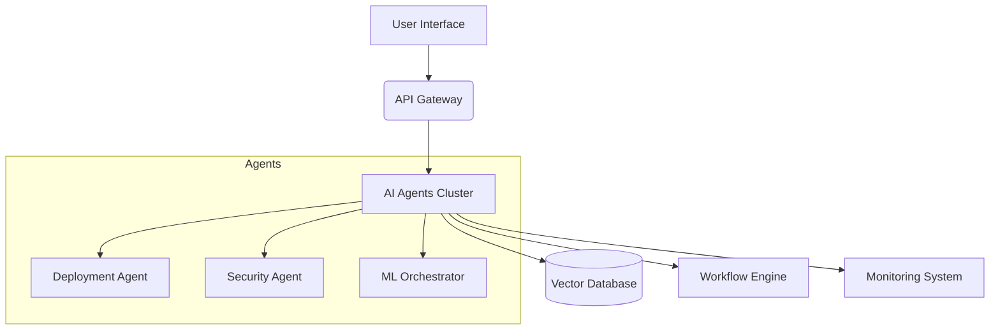
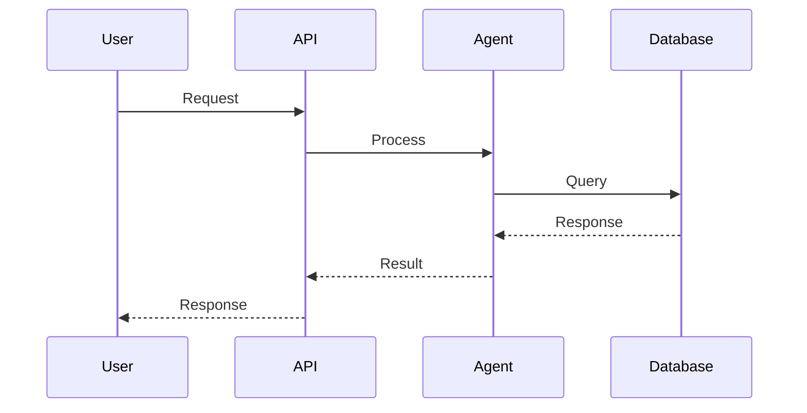

# System Architecture Diagrams

## High-Level Overview


## Data Flow Diagram


## Infrastructure Diagram
```mermaid
graph LR
    A[Load Balancer] --> B[Service Mesh]
    B --> C[AI Microservices]
    B --> D[Database Cluster]
    B --> E[Object Storage]
    B --> F[Monitoring Stack]
    
    C --> G{GPU Nodes}
    D --> H[Primary/Replica]
    F --> I[Prometheus/Grafana]
    F --> J[Graylog]
