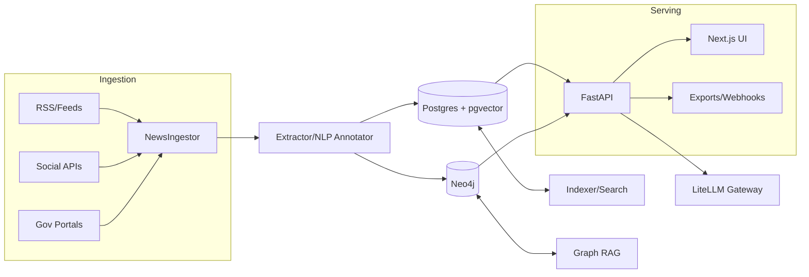

# Architecture



## C4 Context (Simplified)

```mermaid
graph TD
  user[Analyst/Admin] --> web[Next.js Admin]
  web --> api[FastAPI API]
  api --> db[(Postgres)]
  api --> graph[(Neo4j)]
  api --> llm[LiteLLM]
  workers[Agents/Workers] --> db
  workers --> graph
  workers --> llm
```

See **DATA_SCHEMA.md**, **RAG_PIPELINE.md**, **NEWS_INGESTION.md**, **GOVDOC_CRAWLER.md**.
